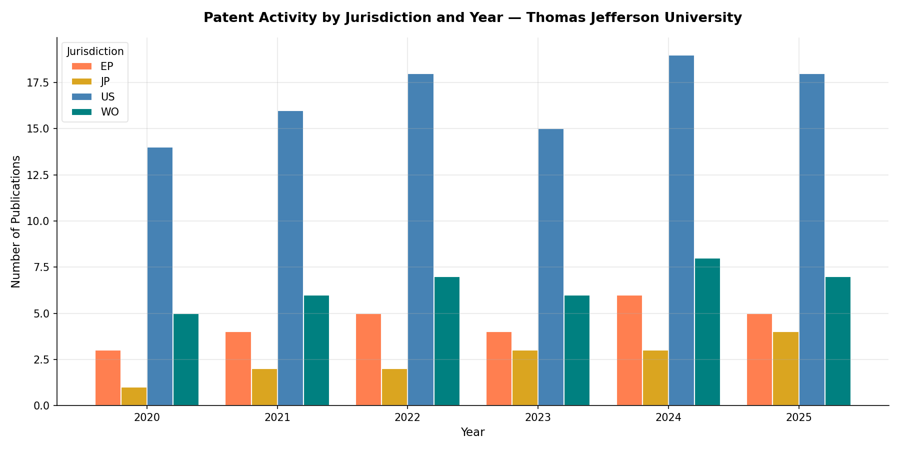

# Examples

Practical examples of using the Patent Scraper pipeline for different use cases.

---

## Example 1: University Tech Transfer — Thomas Jefferson University

Search for all patents granted to Thomas Jefferson University since January 2025.

**Input:**
```
Assignee name: Thomas Jefferson University
Start date: 20250101
Parallel fetch: n
```

**Assignee review output:**
```
ASSIGNEE REVIEW — the following organizations were returned
by SerpAPI for your search: 'Thomas Jefferson University'

  1. Thomas Jefferson University
  2. Univ Jefferson
  3. トーマス・ジェファーソン・ユニバーシティ  (Japanese: Thomas Jefferson University)
  4. 토마스 제퍼슨 유니버시티              (Korean: Thomas Jefferson University)

Exclude numbers (or Enter to keep all):
```
→ Press Enter to keep all — all four refer to the same institution in different jurisdictions.

**Output:**
```
search_20260101_120000_Thomas_Jefferson_University_20250101/
├── TJU_20250101_patents.xlsx      ← Granted + All Activity sheets
└── TJU_20250101_summary.txt
```

**Sample Granted sheet (truncated):**

| Patent Number | Title | Assignee | Co-Assignees | Grant Date |
|--------------|-------|----------|--------------|------------|
| US12269155B2 | Multivalent vaccines for rabies virus and coronaviruses | Thomas Jefferson University | University of Maryland Baltimore, US Dept of Health and Human Services | 2025-04-08 |
| EP3840654B1 | Acoustic sensor and ventilation monitoring system | Thomas Jefferson University | None | 2025-04-23 |
| AU2022206776B2 | Methods and compositions for treating cancers | Thomas Jefferson University | None | 2025-05-08 |

---

## Example 2: Ambiguous Assignee Name — Philadelphia University

Philadelphia University merged with Thomas Jefferson University in 2017. Searching by name returns patents from multiple Philadelphia-based institutions. The assignee review step lets you filter accurately.

**Input:**
```
Assignee name: Philadelphia University
Start date: 20170101
Parallel fetch: n
```

**Assignee review output:**
```
ASSIGNEE REVIEW — the following organizations were returned
by SerpAPI for your search: 'Philadelphia University'

  1. Philadelphia University
  2. Philadelphia Health & Education Corporation, D/B/A Drexel University...
  3. University Of The Sciences In Philadelphia
  4. The Trustees Of The University Of Philadelphia
  5. 费城健康及教育公司，d/b/a,德雷克塞尔大学医学院  (Chinese: Philadelphia Health & Education Corp / Drexel)

Exclude numbers (or Enter to keep all): 2, 3, 5
```
→ Exclude the Drexel and University of Sciences entries. Keep #1 and #4 which are legitimate Philadelphia University entities.

**Why this matters:** Without the review step, results would include patents from Drexel University and University of the Sciences — entirely separate institutions that happen to share "Philadelphia" in their name or history.

---

## Example 3: Corporate Assignee — International Search

Search for patents assigned to a company with filings across multiple jurisdictions.

**Input:**
```
Assignee name: Pfizer
Start date: 20240101
Parallel fetch: y
Workers: 8
```

**Notes:**
- Parallel fetch is recommended for large assignees with many patents
- Expect a longer assignee review list due to subsidiary names, international variants, and joint ventures
- The cache will speed up any follow-on searches significantly

---

## Example 4: Downstream Analysis and Visualization

Load the Excel output into pandas for analysis and visualization. Requires `matplotlib` (`pip install matplotlib`).

```python
import pandas as pd
import matplotlib.pyplot as plt

df = pd.read_excel("search_.../TJU_20250101_patents.xlsx", sheet_name="All Activity")
df["Grant Date"] = pd.to_datetime(df["Grant Date"], errors="coerce")
df["Publication Date"] = pd.to_datetime(df["Publication Date"], errors="coerce")
```

### Chart 1: Grants by Year


```python
grants = df[df["Grant Date"].notna()]
grants_by_year = grants.groupby(grants["Grant Date"].dt.year)["Patent Number"].count()

fig, ax = plt.subplots(figsize=(10, 5))
grants_by_year.plot(kind="bar", ax=ax, color="steelblue", edgecolor="white")
ax.set_title("Granted Patents by Year", fontsize=14, fontweight="bold")
ax.set_xlabel("Year")
ax.set_ylabel("Number of Grants")
ax.tick_params(axis="x", rotation=45)
plt.tight_layout()
plt.savefig("grants_by_year.png", dpi=150)
plt.show()
```

### Chart 2: Top Co-Assignees


```python
co = df[df["Co-Assignees"].notna() & (df["Co-Assignees"] != "None")]

# Split multi-value co-assignee cells and count
from collections import Counter
all_co = []
for val in co["Co-Assignees"]:
    all_co.extend([x.strip() for x in str(val).split(",")])

top_co = pd.Series(Counter(all_co)).sort_values(ascending=True).tail(10)

fig, ax = plt.subplots(figsize=(10, 6))
top_co.plot(kind="barh", ax=ax, color="teal", edgecolor="white")
ax.set_title("Top Co-Assignees", fontsize=14, fontweight="bold")
ax.set_xlabel("Number of Joint Patents")
plt.tight_layout()
plt.savefig("top_co_assignees.png", dpi=150)
plt.show()
```

### Chart 3: Activity by Jurisdiction Over Time



```python
df["Year"] = df["Publication Date"].dt.year
df["Jurisdiction"] = df["Patent Number"].str.extract(r"^([A-Z]{2})")

pivot = df.groupby(["Year", "Jurisdiction"])["Patent Number"].count().unstack(fill_value=0)

fig, ax = plt.subplots(figsize=(12, 6))
pivot.plot(kind="bar", ax=ax, edgecolor="white")
ax.set_title("Patent Activity by Jurisdiction and Year", fontsize=14, fontweight="bold")
ax.set_xlabel("Year")
ax.set_ylabel("Number of Publications")
ax.tick_params(axis="x", rotation=45)
ax.legend(title="Jurisdiction", bbox_to_anchor=(1.05, 1), loc="upper left")
plt.tight_layout()
plt.savefig("activity_by_jurisdiction.png", dpi=150)
plt.show()
```

### Keyword Filtering

```python
# Filter by keyword in title
crispr = df[df["Title"].str.contains("CRISPR|gene edit", case=False, na=False)]
print(f"CRISPR-related patents: {len(crispr)}")
```

---

## Example 5: Monitoring a Patent Portfolio Over Time

Run the scraper periodically with an incrementally advancing start date to track new activity:

```
January run:  start date = 20250101
February run: start date = 20250201
March run:    start date = 20250301
```

The cache ensures inventors and co-assignees for previously seen patents are not re-fetched, making incremental runs fast.

---

## Tips

- **Large assignees** (Fortune 500, major universities) may return 100+ results — use parallel fetch with 5-10 workers
- **Ambiguous names** (city-based institutions, common words) — always review the assignee list carefully
- **Non-English patents** — Japanese, Korean, and Chinese assignee names are expected and correct; do not exclude them unless you are certain they refer to a different entity
- **Cache management** — `patent_cache.json` accumulates over time. Delete it only if you suspect stale data
