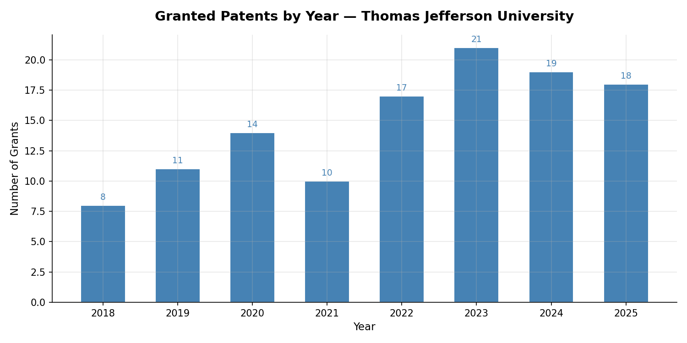
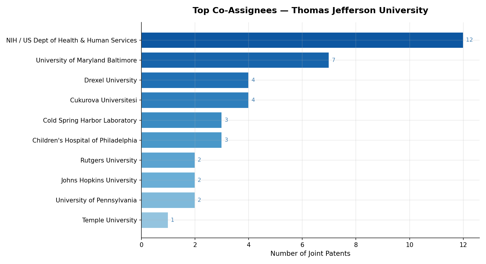
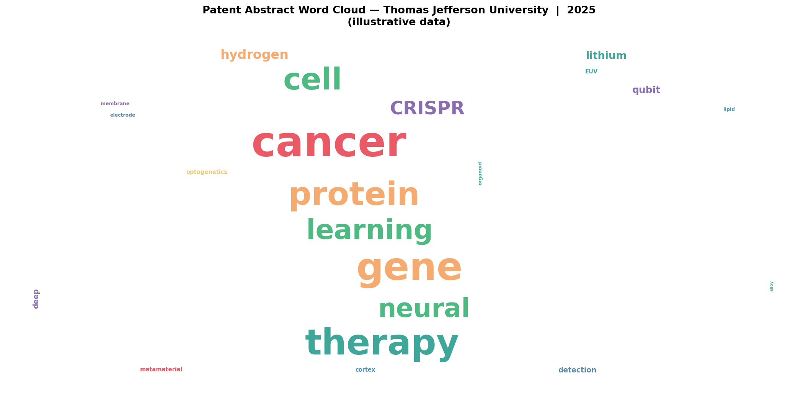
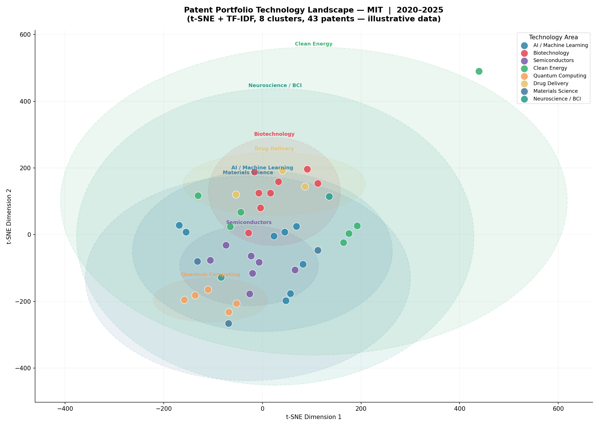
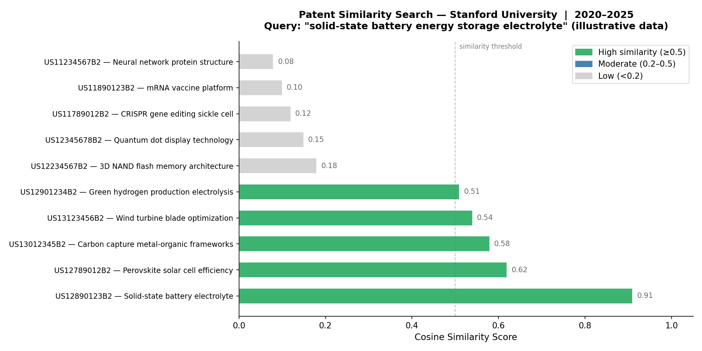

# Examples

Practical examples of using the Patent Scraper pipeline for different use cases.

---

## Example 1: University Tech Transfer — Thomas Jefferson University

Search for all patents granted to Thomas Jefferson University since January 2025.

**Input:**
```
Assignee name: Thomas Jefferson University
Start date: 20250101
Parallel fetch: n
```

**Assignee review output:**
```
ASSIGNEE REVIEW — the following organizations were returned
by SerpAPI for your search: 'Thomas Jefferson University'

  1. Thomas Jefferson University
  2. Univ Jefferson
  3. トーマス・ジェファーソン・ユニバーシティ  (Japanese: Thomas Jefferson University)
  4. 토마스 제퍼슨 유니버시티              (Korean: Thomas Jefferson University)

Exclude numbers (or Enter to keep all):
```
→ Press Enter to keep all — all four refer to the same institution in different jurisdictions.

**Output:**
```
search_20260101_120000_Thomas_Jefferson_University_20250101/
├── TJU_20250101_patents.xlsx      ← Granted + All Activity sheets
└── TJU_20250101_summary.txt
```

**Sample Granted sheet (truncated):**

| Patent Number | Title | Assignee | Co-Assignees | Grant Date |
|--------------|-------|----------|--------------|------------|
| US12269155B2 | Multivalent vaccines for rabies virus and coronaviruses | Thomas Jefferson University | University of Maryland Baltimore, US Dept of Health and Human Services | 2025-04-08 |
| EP3840654B1 | Acoustic sensor and ventilation monitoring system | Thomas Jefferson University | None | 2025-04-23 |
| AU2022206776B2 | Methods and compositions for treating cancers | Thomas Jefferson University | None | 2025-05-08 |

---

## Example 2: Ambiguous Assignee Name — Philadelphia University

Philadelphia University merged with Thomas Jefferson University in 2017. Searching by name returns patents from multiple Philadelphia-based institutions. The assignee review step lets you filter accurately.

**Input:**
```
Assignee name: Philadelphia University
Start date: 20170101
Parallel fetch: n
```

**Assignee review output:**
```
ASSIGNEE REVIEW — the following organizations were returned
by SerpAPI for your search: 'Philadelphia University'

  1. Philadelphia University
  2. Philadelphia Health & Education Corporation, D/B/A Drexel University...
  3. University Of The Sciences In Philadelphia
  4. The Trustees Of The University Of Philadelphia
  5. 费城健康及教育公司，d/b/a,德雷克塞尔大学医学院  (Chinese: Philadelphia Health & Education Corp / Drexel)

Exclude numbers (or Enter to keep all): 2, 3, 5
```
→ Exclude the Drexel and University of Sciences entries. Keep #1 and #4 which are legitimate Philadelphia University entities.

**Why this matters:** Without the review step, results would include patents from Drexel University and University of the Sciences — entirely separate institutions that happen to share "Philadelphia" in their name or history.

---

## Example 3: Corporate Assignee — International Search

Search for patents assigned to a company with filings across multiple jurisdictions.

**Input:**
```
Assignee name: Pfizer
Start date: 20240101
Parallel fetch: y
Workers: 8
```

**Notes:**
- Parallel fetch is recommended for large assignees with many patents
- Expect a longer assignee review list due to subsidiary names, international variants, and joint ventures
- The cache will speed up any follow-on searches significantly

---

## Example 4: Downstream Analysis and Visualization

Load the Excel output into pandas for analysis and visualization.

Requires: `pip install matplotlib scikit-learn wordcloud`

```python
import pandas as pd
import matplotlib.pyplot as plt

df = pd.read_excel("search_.../TJU_20250101_patents.xlsx", sheet_name="All Activity")
df["Grant Date"] = pd.to_datetime(df["Grant Date"], errors="coerce")
df["Publication Date"] = pd.to_datetime(df["Publication Date"], errors="coerce")
```

### Chart 1: Grants by Year



```python
grants = df[df["Grant Date"].notna()]
grants_by_year = grants.groupby(grants["Grant Date"].dt.year)["Patent Number"].count()

fig, ax = plt.subplots(figsize=(10, 5))
grants_by_year.plot(kind="bar", ax=ax, color="steelblue", edgecolor="white")
ax.set_title("Granted Patents by Year", fontsize=14, fontweight="bold")
ax.set_xlabel("Year")
ax.set_ylabel("Number of Grants")
ax.tick_params(axis="x", rotation=45)
plt.tight_layout()
plt.savefig("grants_by_year.png", dpi=150)
plt.show()
```

### Chart 2: Top Co-Assignees



```python
co = df[df["Co-Assignees"].notna() & ~df["Co-Assignees"].isin(["None", "NaN", "nan"])]

from collections import Counter
all_co = []
for val in co["Co-Assignees"]:
    all_co.extend([x.strip() for x in str(val).split(",")])

top_co = pd.Series(Counter(all_co)).sort_values(ascending=True).tail(10)

fig, ax = plt.subplots(figsize=(10, 6))
top_co.plot(kind="barh", ax=ax, color="teal", edgecolor="white")
ax.set_title("Top Co-Assignees", fontsize=14, fontweight="bold")
ax.set_xlabel("Number of Joint Patents")
plt.tight_layout()
plt.savefig("top_co_assignees.png", dpi=150)
plt.show()
```

### Chart 3: Activity by Jurisdiction Over Time


```python
df["Year"] = df["Publication Date"].dt.year
df["Jurisdiction"] = df["Patent Number"].str.extract(r"^([A-Z]{2})")

pivot = df.groupby(["Year", "Jurisdiction"])["Patent Number"].count().unstack(fill_value=0)

fig, ax = plt.subplots(figsize=(12, 6))
pivot.plot(kind="bar", ax=ax, edgecolor="white")
ax.set_title("Patent Activity by Jurisdiction and Year", fontsize=14, fontweight="bold")
ax.set_xlabel("Year")
ax.set_ylabel("Number of Publications")
ax.tick_params(axis="x", rotation=45)
ax.legend(title="Jurisdiction", bbox_to_anchor=(1.05, 1), loc="upper left")
plt.tight_layout()
plt.savefig("activity_by_jurisdiction.png", dpi=150)
plt.show()
```

### Chart 4: Patent Abstract Word Cloud

Visualize the most frequent terms across all patent abstracts — larger words appear more often. Useful for quickly identifying a portfolio's core technology themes.

```python
from wordcloud import WordCloud

text = " ".join(df["Abstract"].dropna().tolist())

wc = WordCloud(
    width=1400, height=700,
    background_color="white",
    colormap="Blues",
    max_words=100,
    collocations=False
).generate(text)

fig, ax = plt.subplots(figsize=(14, 7))
ax.imshow(wc, interpolation="bilinear")
ax.axis("off")
ax.set_title("Patent Abstract Word Cloud — Thomas Jefferson University  |  2025",
             fontsize=14, fontweight="bold", pad=15)
plt.tight_layout()
plt.savefig("wordcloud_TJU.png", dpi=150)
plt.show()
```



*Sample output: most frequent terms across Thomas Jefferson University patent abstracts (illustrative data, 2025)*

### Chart 5: Technology Clustering with TF-IDF + t-SNE

Group patents by technology area using TF-IDF vectorization and t-SNE dimensionality reduction. Useful for landscape mapping and identifying R&D focus areas.

```python
from sklearn.feature_extraction.text import TfidfVectorizer
from sklearn.manifold import TSNE
from matplotlib.patches import Ellipse

vectorizer = TfidfVectorizer(max_features=1500, stop_words="english", ngram_range=(1, 2))
X = vectorizer.fit_transform(df["Abstract"])

tsne = TSNE(n_components=2, random_state=7, perplexity=7, max_iter=3000, learning_rate=120)
coords = tsne.fit_transform(X.toarray())
df["x"], df["y"] = coords[:, 0], coords[:, 1]

# Auto-assign colors — scales to any number of clusters
import matplotlib.cm as cm
clusters = df["ClusterName"].unique()
cmap = cm.get_cmap("tab20", len(clusters))
cluster_colors = {name: cmap(i) for i, name in enumerate(clusters)}

fig, ax = plt.subplots(figsize=(14, 10))
for name, color in cluster_colors.items():
    mask = df["ClusterName"] == name
    if not mask.any():
        continue
    ax.scatter(df[mask]["x"], df[mask]["y"], c=color, s=150, alpha=0.88,
               edgecolors="white", linewidths=0.8, label=name)
    cx, cy = df[mask]["x"].mean(), df[mask]["y"].mean()
    sx = max(df[mask]["x"].std() * 2.6, 5)
    sy = max(df[mask]["y"].std() * 2.6, 5)
    ellipse = Ellipse((cx, cy), width=sx*2, height=sy*2,
                      facecolor=color, alpha=0.10, edgecolor=color,
                      linewidth=1.4, linestyle="--")
    ax.add_patch(ellipse)
    ax.text(cx, cy + sy + 1.5, name, ha="center", va="bottom",
            fontsize=8.5, color=color, fontweight="bold")

ax.set_title("Patent Portfolio Technology Landscape — MIT  |  2020–2025", fontweight="bold")
ax.set_xlabel("t-SNE Dimension 1")
ax.set_ylabel("t-SNE Dimension 2")
ax.legend(title="Technology Area", loc="upper right")
plt.tight_layout()
plt.savefig("patent_clustering.png", dpi=150)
plt.show()
```



*Sample output: 43 patents from MIT's portfolio across 8 technology clusters with natural overlap between related fields (illustrative data, 2020–2025)*

### Chart 6: Semantic Similarity Search

Find patents most similar to a technology description using TF-IDF cosine similarity. Useful for prior art searches and identifying related work.

```python
from sklearn.metrics.pairwise import cosine_similarity
import matplotlib.patches as mpatches

query = "solid-state battery energy storage electrolyte"

corpus = df["Abstract"].tolist() + [query]
vectorizer = TfidfVectorizer(max_features=500, stop_words="english")
X = vectorizer.fit_transform(corpus)

similarities = cosine_similarity(X[-1], X[:-1]).flatten()
df["Similarity"] = similarities
top = df.nlargest(10, "Similarity")[["Patent Number", "Title", "Similarity"]]

fig, ax = plt.subplots(figsize=(12, 6))
colors = ["mediumseagreen" if s >= 0.5 else "steelblue" if s >= 0.2 else "lightgray"
          for s in top["Similarity"]]
ax.barh(top["Title"].str[:50], top["Similarity"], color=colors, edgecolor="white")
ax.set_xlabel("Cosine Similarity Score")
ax.set_title(f'Patent Similarity Search — Stanford University  |  2020–2025\nQuery: "{query}"',
             fontweight="bold")
ax.axvline(x=0.5, color="gray", linestyle="--", alpha=0.5)

high = mpatches.Patch(color="mediumseagreen", label="High similarity (>=0.5)")
med  = mpatches.Patch(color="steelblue",      label="Moderate (0.2-0.5)")
low  = mpatches.Patch(color="lightgray",      label="Low (<0.2)")
ax.legend(handles=[high, med, low], loc="upper right", framealpha=0.7)
plt.tight_layout()
plt.savefig("patent_similarity.png", dpi=150)
plt.show()
```



*Sample output: Stanford University patents ranked by semantic similarity to the query "solid-state battery energy storage electrolyte" (illustrative data, 2020–2025)*

---

## Example 5: Monitoring a Patent Portfolio Over Time

Run the scraper periodically with an incrementally advancing start date to track new activity. The cache ensures inventors and co-assignees for previously seen patents are not re-fetched, making incremental runs fast.

```
January run:   start date = 20250101
February run:  start date = 20250201
March run:     start date = 20250301
```

**Sample output:**

```
=== Run: January 2025 (from 20250101) ===
  Granted:      4 patents
  All Activity: 12 patents
  API credits used: 2

=== Run: February 2025 (from 20250201) ===
  Granted:      2 patents
  All Activity: 7 patents
  API credits used: 2

=== Run: March 2025 (from 20250301) ===
  Granted:      3 patents
  All Activity: 9 patents
  API credits used: 2
```


**API credits used:** ~2 per run × 3 runs = 6 credits (well within the 250/month free tier)


